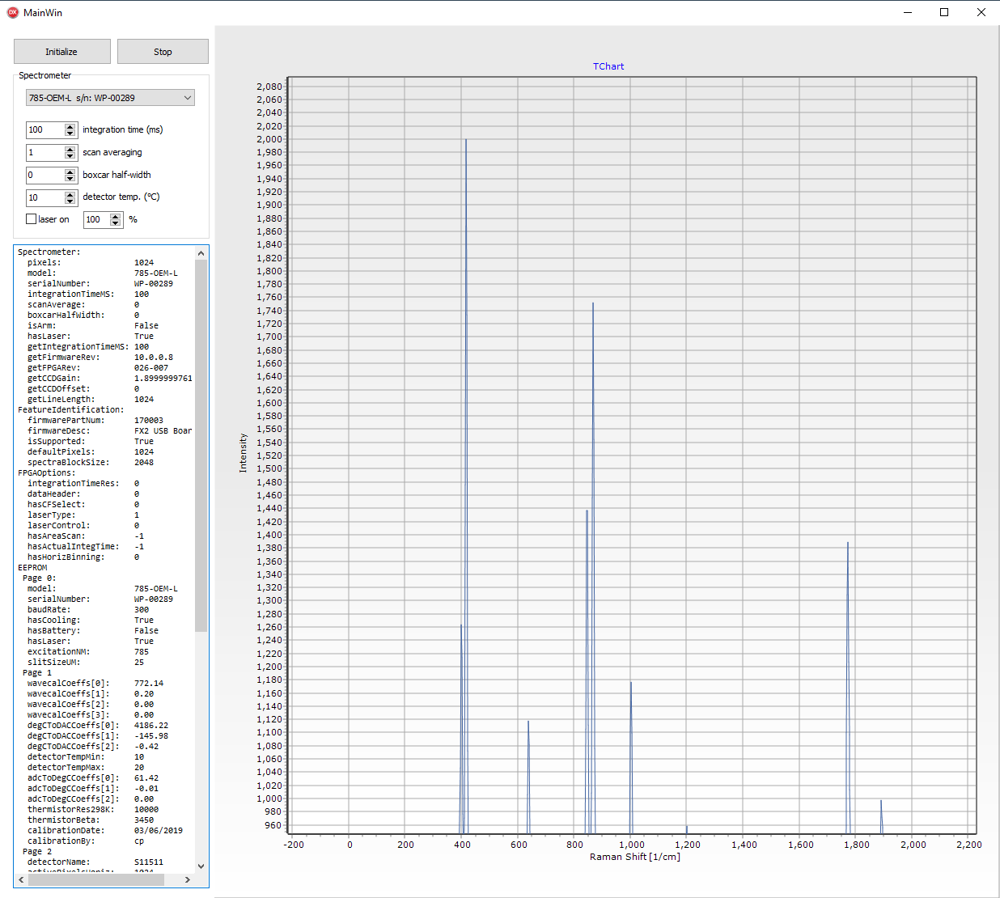

# Overview

A simple demo showing how to call 
[Wasatch.NET](https://github.com/WasatchPhotonics/Wasatch.NET) from 
[Embarcadero Delphi](https://www.embarcadero.com/products/delphi) 
to control Wasatch Photonics spectrometers from object Pascal.

This demo was generously contributed by 
[Dr. Friedrich Menges](mailto:friedrich.menges@effemm2.de),
the Spectroscopy Ninja himself, developer of the
powerful and multi-vendor [Spectragryph](https://www.effemm2.de/spectragryph)
spectroscopy platform.  

# Dependencies

The demo has been tested with Wasatch.NET 1.0.27 (32-bit) and 
[Delphi Community Edition](https://www.embarcadero.com/products/delphi/starter)
(10.2 Tokyo) on a Windows 10 (64-bit) host.

# Build Notes

Remember to use the provided script to 
[register Wasatch.NET's COM assembly](https://github.com/WasatchPhotonics/Wasatch.NET#post-install-step-2-com-registration-optional),
else you won't be able to find the COM assemblies.

You'll want to import a TLB for WasatchNET.dll from the most recent 
[Wasatch.NET](https://github.com/WasatchPhotonics/Wasatch.NET) release.

You'll also have to import the mscorlib\_tlb and system\_windows\_forms\_tlb
packages from .NET Framework 3.5.

# History

- 2018-07-23 1.0.1
    - cleanup by Friedrich
- 2018-07-20 1.0.0
    - Initial version

